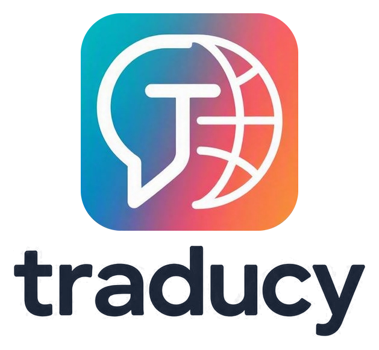
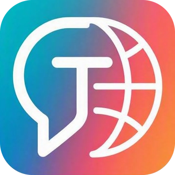

<div align="center">



**Traductor de pantalla en tiempo real para Windows**

Marca una zona sobre el juego. Traducy lee el texto que aparece ahí y muestra la
traducción como subtítulos por encima, sin tocar el juego ni sus ficheros.

[](https://github.com/Litdemonick/traducy/releases/latest)
[](#requisitos)
[](#compilar-y-ejecutar)

</div>

---

Pensado para jugar a juegos en japonés, chino, coreano, inglés o cualquier otro
idioma sin traducción oficial.

<table>
<tr><td width="50%">

**Lo que hace**

- Lee una zona de la pantalla que tú decides
- Traduce y lo muestra como subtítulos personalizables
- Zona y subtítulos, cada uno con su candado
- No bloquea los clics: se sigue jugando con los marcos puestos
- Se actualiza solo desde este repositorio

</td><td width="50%">

**Lo que no hace**

- No modifica el juego ni sus ficheros
- No inyecta nada en su proceso
- No lee memoria del juego
- No envía nada a ningún sitio salvo el texto a traducir
- No necesita permisos de administrador para funcionar

</td></tr>
</table>

## Índice

| | |
|---|---|
| [Cómo funciona](#cómo-funciona) · [Requisitos](#requisitos) · [Primeros pasos](#primeros-pasos) | Empezar |
| [El overlay no te bloquea el ratón](#el-overlay-no-te-bloquea-el-ratón) · [Minimizar y modo juego](#minimizar-y-modo-juego) · [Atajos globales](#atajos-globales) · [La caja de subtítulos](#la-caja-de-subtítulos) · [Los dos candados](#los-dos-candados) | Uso diario |
| [Motores de traducción](#motores-de-traducción) · [Ajustar la precisión del OCR](#ajustar-la-precisión-del-ocr) · [Problemas frecuentes](#problemas-frecuentes) | Afinar |
| [Compilar y ejecutar](#compilar-y-ejecutar) · [Estructura del código](#estructura-del-código) · [Pruebas](#pruebas) | Desarrollo |
| [Crear el instalador](#crear-el-instalador-para-compartir) · [Versiones](#versiones) · [Actualizaciones automáticas](#actualizaciones-automáticas) | Publicar |

## Cómo funciona

```
Zona de captura ──▶ Captura GDI ──▶ Preprocesado ──▶ OCR ──▶ Traducción ──▶ Subtítulo
   (tú la marcas)      ~2 ms         otro isolate    Tesseract   caché+red      overlay
```

Tres decisiones sostienen el rendimiento:

- **Detección de cambios.** Antes de gastar un OCR se compara una huella de
  32×32 con la del fotograma anterior, contando cuántas celdas se han movido de
  verdad. Si el diálogo sigue siendo el mismo, no se vuelve a leer ni a traducir.
  En una partida normal se salta el 80–95 % de los fotogramas.
- **Caché de traducciones.** Los juegos repiten muchísimo texto (menús, nombres
  de objetos, la misma línea mientras la lees). Lo repetido se resuelve al
  instante y sin gastar cuota.
- **Contrapresión.** Solo hay un ciclo activo a la vez. Si un fotograma tarda
  más que el intervalo, el siguiente se descarta en lugar de acumularse en una
  cola que acabaría mostrando subtítulos con segundos de retraso.

> [!NOTE]
> La huella cuenta **celdas cambiadas**, no la diferencia media de píxeles. La
> media diluye justo lo que interesa: un renglón nuevo dentro de una franja
> ancha mueve mucho unas pocas celdas y nada el resto, y su media queda tan baja
> que se confunde con no haber cambiado nada.

## Requisitos

- **Windows 10 versión 2004 o posterior.** En versiones anteriores funciona, pero
  el overlay no puede excluirse de su propia captura y hay que mantener los
  subtítulos fuera de la zona de lectura.
- **Tesseract OCR.** Es el único requisito externo:

```powershell
winget install UB-Mannheim.TesseractOCR
```

Durante su instalación, en la pantalla de componentes, marca los **idiomas
adicionales** que vayas a leer (Japanese, Chinese, Korean…).

> [!TIP]
> Si ya lo tienes instalado sin esos idiomas, no hace falta reinstalar nada:
> Traducy los descarga desde la pestaña **Idiomas** con un botón, en su propia
> carpeta y sin pedir permisos de administrador.

Traducy detecta Tesseract solo: en el `PATH`, en las rutas de instalación
habituales, o en una carpeta `tesseract\` junto al ejecutable. Si no lo
encuentra, la ruta se puede indicar a mano en **Diagnóstico**.

## Primeros pasos

1. Abre el juego **en modo ventana** o **pantalla completa en ventana**. La
   pantalla completa exclusiva no se puede capturar con GDI; Traducy lo detecta y
   te lo dice en lugar de quedarse callado.
2. Arranca Traducy. Se abre en modo configuración con el panel, que se arrastra
   desde su cabecera a donde estorbe menos.
3. En **Zona**, pulsa **Detectar el juego**. Traducy encuentra su ventana y
   coloca la zona en su parte baja, donde ponen el diálogo casi todos; además
   queda anclada, así que mover el juego no obliga a recolocar nada.
   Si prefieres situarla a mano, activa *Activar zona de captura* y usa *Banda
   inferior* o *Pantalla completa* sobre el rectángulo verde.
4. En **Idiomas**, elige el idioma del juego (p. ej. Japonés) y el de destino
   (Español por defecto).
5. Pulsa **Traducir**.
6. Con `Ctrl+Alt+T` ocultas el panel y pasas a modo juego.

> [!IMPORTANT]
> Cuanto más ceñida esté la zona al texto, mejor lee el OCR y menos CPU gasta.
> Una zona a pantalla completa funciona, pero es el peor caso para las dos cosas.

## El overlay no te bloquea el ratón

Traducy cubre toda la pantalla, pero **solo intercepta el ratón donde hay algo
con lo que interactuar**: el panel, las barras de título de las cajas y sus
tiradores de borde. Todo lo demás — incluido el interior del rectángulo verde y
el de los subtítulos — deja pasar los clics al programa de debajo.

- Los marcos **solo aparecen si los activas** desde la pestaña Zona. No salen
  solos encima del juego.
- Las cajas se mueven arrastrando su **barra de título** y se redimensionan por
  los **tiradores del borde**, como una ventana normal.
- Si algo no responde como esperas, desactiva *Poder jugar con el panel abierto*
  en Zona: la ventana pasa a capturar todos los clics mientras el panel esté
  visible, que es el comportamiento simple y predecible.

## Minimizar y modo juego

Son dos cosas distintas, y cada una tiene su botón en la cabecera del panel:

| Botón | Qué hace | Cómo se vuelve |
|---|---|---|
| **–** Minimizar | Minimiza la ventana. Su botón **sigue en la barra de tareas**. | Pulsando ese botón de la barra de tareas |
| **👁** Modo juego | Oculta Traducy del todo y lo deja en segundo plano, con su icono junto al reloj (área de iconos ocultos). | Clic izquierdo en el icono, o `Ctrl+Alt+T` |
| **⏻** Salir | Cierra Traducy de verdad, volcando los ajustes antes. | — |

En el icono de la bandeja:

- **Clic izquierdo**: recupera la ventana y abre el panel de control.
- **Clic derecho**: menú con abrir, pausar o reanudar la traducción, mostrar u
  ocultar los subtítulos, y salir.

## Atajos globales

| Atajo | Acción |
|---|---|
| `Ctrl+Alt+T` | Mostrar / ocultar el panel de configuración |
| `Ctrl+Alt+P` | Pausar / reanudar la traducción |
| `Ctrl+Alt+H` | Ocultar / mostrar los subtítulos |

Funcionan aunque el juego tenga el foco. Si otro programa ya los tiene tomados,
Traducy lo anota en el diagnóstico y sigue funcionando desde el panel.

## La caja de subtítulos

- **Se adapta a su tamaño.** La letra se encoge lo necesario para que el texto
  entre entero en la caja, y nada se pinta fuera de ella: la caja que colocas es
  exactamente lo que se ve.
- **Guarda las líneas anteriores.** La caja es un registro de la conversación, no
  una frase que se borra sola: lo último abajo, lo anterior encima y atenuado.
  Baja sola a lo nuevo salvo que hayas subido a leer.
- **Con scroll**, disponible al activar la caja desde el panel. Fuera de ahí la
  caja deja pasar el ratón al juego, y capturar la rueda significaría capturar
  también los clics.

Ambas cosas se ajustan en **Estilo**.

## Los dos candados

La zona de captura y la caja de subtítulos son independientes y **cada una tiene
su propio candado** en su barra de título:

- 🟩 **Zona de captura** — dónde se lee el texto.
- 🟧 **Subtítulos** — dónde se muestra la traducción.

Bloquear una no bloquea la otra, así que se puede fijar la zona de lectura al
milímetro y seguir moviendo los subtítulos, o al contrario.

## Motores de traducción

| Motor | Clave | Notas |
|---|---|---|
| **Google Traductor** | No | Por defecto. Endpoint web público, sin configuración. Puede limitar la frecuencia si se abusa. |
| **Claude** | Sí | La mejor calidad para videojuegos: entiende el contexto, mantiene el tono y respeta los nombres propios. Admite glosario. De pago por uso. |
| **DeepL** | Sí | Muy buena calidad en prosa. Las claves gratuitas terminan en `:fx` y Traducy lo detecta solo. |
| **LibreTranslate** | Opcional | Servidor propio. La opción para traducir sin depender de terceros ni de internet. |
| **Sin traducir** | No | Muestra solo el texto reconocido. Útil para afinar el OCR. |

Las claves se guardan en el fichero de ajustes local, nunca se envían a ningún
sitio que no sea el propio servicio, y el traductor lleva un **cortacircuitos**:
tras varios fallos seguidos deja de insistir en lugar de gastar cuota contra un
servicio caído.

## Ajustar la precisión del OCR

Si el reconocimiento falla, la pestaña **Rendimiento** da más resultado que
cambiar de motor:

| Ajuste | Cuándo tocarlo |
|---|---|
| **Escala** ×2 o ×3 | Siempre que el texto sea pequeño. Es el ajuste con más impacto. |
| **Contraste** | Texto de bajo contraste sobre fondos con textura. |
| **Binarizar** | Texto de color plano sobre fondo plano. Estorba en fondos complejos: por eso viene en 0. |
| **Invertir** | Texto claro sobre fondo oscuro, si el OCR falla más de lo normal. |
| **Reducir ruido** | Vídeo comprimido o escalado. |
| **Cambio mínimo** | Bájalo si no detecta diálogos nuevos; súbelo si traduce de más con fondos animados. |
| **Estabilidad** | Súbelo a 3 o 4 si el juego escribe el diálogo letra a letra. |

Para japonés, chino y coreano, Traducy junta los caracteres que Tesseract separa
y descarta las líneas que son sobre todo signos: sin eso, el traductor recibe
`こ ん に ち は` en lugar de `こんにちは` y devuelve un galimatías.

## Problemas frecuentes

<details>
<summary><b>Dice que el OCR no está disponible y no traduce</b></summary>

Falta Tesseract. El panel muestra un aviso rojo con un botón *Instalar con
winget*; o hazlo a mano con el comando de [Requisitos](#requisitos). El traductor
y el OCR son piezas separadas: que el traductor esté listo no sirve de nada si no
hay nada reconocido que traducir.
</details>

<details>
<summary><b>Dice "sin cambios" y no traduce nunca</b></summary>

Baja **Cambio mínimo** en Rendimiento. Ese porcentaje es cuánto tiene que
cambiar la zona para volver a leerla, y si la zona es muy grande respecto al
texto, un renglón nuevo puede quedarse por debajo. El mensaje lleva el porcentaje
medido entre paréntesis, así que se puede ajustar con criterio en lugar de a
ciegas.
</details>

<details>
<summary><b>Dice "la zona no ve texto (imagen plana)"</b></summary>

La captura sale lisa: o el rectángulo no está encima del texto, o el juego está
en pantalla completa exclusiva. Cambia a "ventana" o "pantalla completa en
ventana" en sus opciones de vídeo.
</details>

<details>
<summary><b>La zona sale en negro</b></summary>

Lo mismo: pantalla completa exclusiva. GDI no puede leer de ahí.
</details>

<details>
<summary><b>Traduce sus propios subtítulos</b></summary>

Ocurre solo en Windows anteriores a la versión 2004, donde el overlay no puede
excluirse de la captura. Mueve la caja de subtítulos fuera del rectángulo verde;
el panel avisa cuando se solapan.
</details>

<details>
<summary><b>El fondo del overlay es opaco</b></summary>

Cambia **Zona → Transparencia** al modo *Compatible*, que recorta un color en
lugar de usar transparencia real. Funciona en cualquier equipo, a cambio de
perder los bordes suaves y los fondos translúcidos del subtítulo.
</details>

<details>
<summary><b>Los subtítulos aparecen a medias</b></summary>

Sube *Estabilidad* a 3 o 4 fotogramas: el juego escribe el diálogo letra a letra
y Traducy espera a que el texto se quede quieto antes de traducir.
</details>

<details>
<summary><b>Algún clic no responde con el panel abierto</b></summary>

Desactiva *Poder jugar con el panel abierto* en Zona: la ventana pasa a capturar
todos los clics mientras el panel está visible.
</details>

<details>
<summary><b>Diagnosticar sin abrir el panel</b></summary>

```powershell
flutter run -d windows --profile
```

Al arrancar se vuelca el estado real en la consola: medidas del escritorio,
rectángulo de la ventana, si se pudo excluir de la captura, y si el OCR y el
traductor están listos.
</details>

## Dónde se guarda todo

Todo vive **junto al programa**, en la carpeta que se eligió al instalar:

```
<carpeta de instalación>\datos\
  settings.json        ajustes, con escritura atómica
  tessdata\            idiomas del OCR descargados desde la app
  updates\             instaladores que baja el actualizador
```

El instalador concede permiso de escritura a esa subcarpeta, así que funciona
igual en `C:\Program Files`, en `D:\Juegos` o en un USB, sin pedir permisos de
administrador al abrir. Si el fichero de ajustes se corrompe, Traducy lo aparta
como `.corrupt-<fecha>` y arranca con los valores de fábrica en lugar de quedarse
inservible.

> [!NOTE]
> Solo si esa carpeta no admitiera escritura de verdad (ejecutar desde una ruta
> protegida sin pasar por el instalador, una unidad de solo lectura) los datos
> caen en `%APPDATA%\Traducy`. La pestaña **Acerca de** dice siempre cuál de las
> dos se está usando y por qué.

## Compilar y ejecutar

```powershell
flutter pub get
flutter run -d windows            # desarrollo
flutter run -d windows --profile  # con diagnóstico en consola
flutter build windows --release   # ejecutable final
```

El ejecutable queda en `build\windows\x64\runner\Release\traducy.exe`.

## Crear el instalador para compartir

Con [Inno Setup 6](https://jrsoftware.org/isdl.php) instalado:

```powershell
flutter build windows --release
iscc installer\traducy.iss
```

Sale `installer\salida\TraducySetup-<version>.exe`, un único fichero que se puede
pasar a cualquiera. Lo que hace:

- **Deja elegir la carpeta de instalación**, y ahí va todo: programa, ajustes,
  idiomas del OCR y descargas. Si se instala en `D:`, nada queda en `C:`.
- **Detecta una instalación previa** y actualiza en el mismo sitio en lugar de
  dejar dos copias. Si la instalada es más nueva, avisa antes de sobrescribirla.
- **Cierra Traducy si está abierto** antes de sustituir los ficheros: sin eso, la
  actualización falla con "fichero en uso".
- **Español e inglés** en el asistente.
- **Avisa sobre Tesseract** antes de instalar, para que nadie se lleve la sorpresa
  de que la aplicación no traduce hasta instalarlo.
- **Muestra el autor y los enlaces del proyecto**, para que quien reciba el `.exe`
  pueda comprobar de dónde sale y dónde reportar un fallo.

Al desinstalar se borra la carpeta `datos\`, porque vive dentro de la del
programa.

## Versiones

Para revisiones pequeñas y frecuentes el esquema es `MAYOR.MENOR.PARCHE` con un
sufijo de letras: `1.0.0.a`, `1.0.0.b`, … `1.0.0.z`, `1.0.0.aa`, y así.

```powershell
python tools\set_version.py 1.0.0.bs
```

Ese comando la deja sincronizada en `pubspec.yaml`, en la aplicación
(`lib/src/core/version.dart`) y en el instalador.

> [!WARNING]
> **No editar la versión a mano en cada sitio.** Windows guarda la versión del
> ejecutable como cuatro números, y un sufijo de letras no lo es: conviven dos
> formas de lo mismo, `1.0.0.bs` para leer y `1.0.0.71` para los metadatos. El
> script calcula la segunda a partir de la primera (letras a número, como las
> columnas de una hoja de cálculo), de modo que el orden de versiones se conserva
> y el instalador puede comparar cuál es más reciente.

## Actualizaciones automáticas

Traducy consulta las releases de este repositorio al arrancar. Cuando hay una
versión nueva:

1. **Detiene la traducción y bloquea la aplicación.** Es a propósito: una versión
   vieja funcionando a medias da resultados raros que parecen fallos de la propia
   aplicación.
2. Pulsando **Actualizar ahora** descarga el instalador mostrando el progreso.
3. Vuelca los ajustes a disco, lanza el instalador y se cierra. El instalador
   sustituye la versión anterior en la misma carpeta y vuelve a abrir Traducy.

La pantalla de bloqueo **siempre ofrece salir**, y si la descarga falla ofrece
reintentar y enseña la dirección para bajarla a mano: un fallo de red no debe
dejar a nadie encerrado sin poder cerrar el programa.

> [!NOTE]
> No hay ningún token dentro del ejecutable. El repositorio es público justo para
> eso: una credencial incrustada en un `.exe` que se reparte es una credencial
> regalada a quien lo tenga.

### Ramas

| Rama | Para qué |
|---|---|
| `develop` | Donde se trabaja. Todo va aquí primero. |
| `main` | Lo que está probado. **Las releases se publican solo desde aquí.** |

```powershell
git switch develop
# ... trabajo, commits, push a develop ...
git push origin develop

# cuando develop esta bien probado:
git switch main
git merge --ff-only develop
git push origin main
```

Publicar desde `develop` sería un problema real, no una cuestión de orden: el
actualizador de la aplicación mira la última release del repositorio y bloquea a
todo el mundo hasta instalarla. Una release hecha desde una rama a medio probar
se reparte igual que una buena.

### Publicar una versión nueva

Con `main` ya actualizada:

```powershell
python tools\set_version.py 1.0.0.c
flutter build windows --release
iscc installer\traducy.iss
gh release create v1.0.0.c installer\salida\TraducySetup-1.0.0.c.exe `
  --title "Traducy 1.0.0.c" --notes "..."
```

La etiqueta debe ser `v` más la versión, y el adjunto tiene que ser un `.exe` con
`Setup` en el nombre: es lo que busca el actualizador entre los ficheros de la
release.

## Estructura del código

```
lib/
  main.dart                     arranque, ventana, atajos, bandeja, cierre limpio
  src/
    core/       registro en memoria, fallos por etapa, rutas, versión,
                actualizador y datos del proyecto
    native/     FFI de Win32: captura GDI, estilos del overlay, ventanas, cursor
    models/     ajustes, idiomas, persistencia
    ocr/        preprocesado en isolate, motor Tesseract, limpieza de texto
    translate/  motores de traducción, caché LRU, cortacircuitos
    pipeline/   orquestador con contrapresión y autopausa
    state/      controlador central
    ui/         overlay, cajas arrastrables, panel, consolas, subtítulos, bandeja
tools/
  set_version.py                sincroniza la versión en los tres sitios
installer/
  traducy.iss                   instalador Inno Setup (ES/EN)
test/
  logic_test.dart               lógica pura: OCR, huellas, ajustes, caché, versiones
  draggable_box_test.dart       arrastre, bloqueo y paso de clics de las cajas
  subtitle_view_test.dart       cuándo aparece y cuándo no la caja de texto
```

### Por qué FFI a mano en lugar de `package:win32`

Las constantes y firmas de Win32 no cambian nunca; las de un paquete sí. Escribir
las pocas que hacen falta como literales deja el proyecto inmune a los cambios de
API de un paquete intermedio, y hace evidente qué llamada del sistema se está
usando en cada sitio.

## Pruebas

```powershell
flutter test
dart analyze
```

---

<div align="center">



**Traducy** · hecho por [Litdemonick](https://github.com/Litdemonick)

[Repositorio](https://github.com/Litdemonick/traducy) ·
[Versiones](https://github.com/Litdemonick/traducy/releases) ·
[Reportar un fallo](https://github.com/Litdemonick/traducy/issues)

Traducy usa [Tesseract OCR](https://github.com/tesseract-ocr/tesseract)
(Apache 2.0), [Flutter](https://flutter.dev) (BSD 3-Clause) e
[Inno Setup](https://jrsoftware.org/isinfo.php).

</div>
